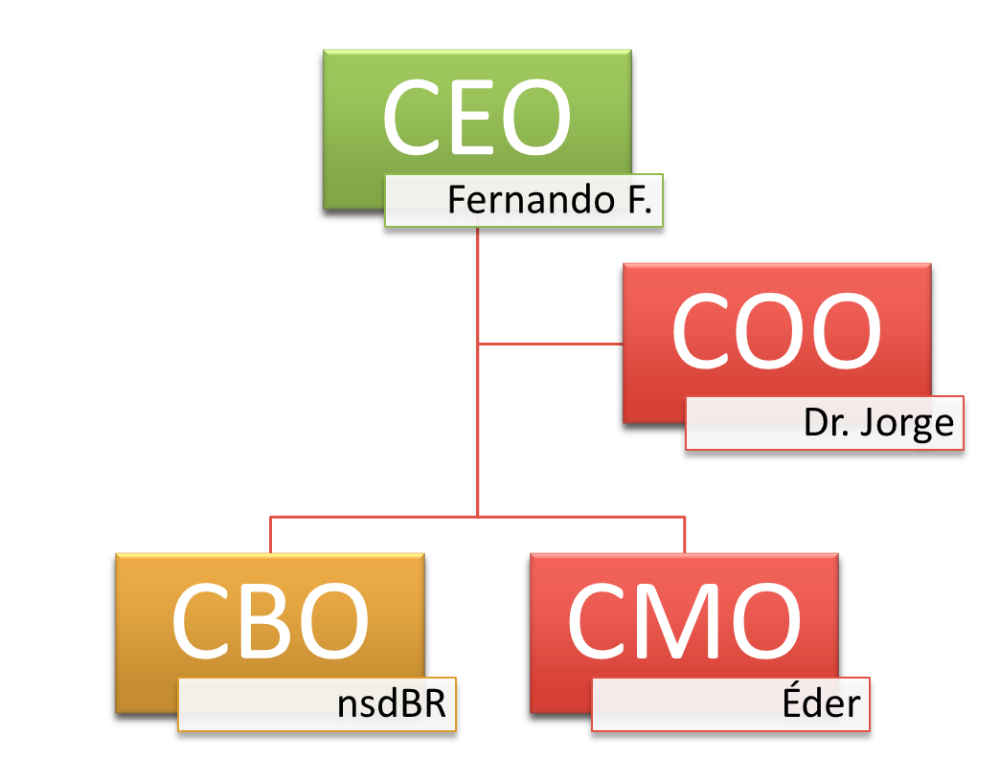

# 🪙 TOKENOMICS

Criado na rede da Binance Smart Chain (BSC) o token da $IMOV possui um Supply de 01 BILHÃO sendo destes 60% queimados inicialmente no lançamento com Supply circulante de 400 MILHÕES.&#x20;

100% - TOTAL SUPPLY

60% QUEIMADOS INICIAL (BURNED)

10% CARTEIRA MARKETING (NÃO VENDE MOEDAS - UTILIZAÇÃO E QUEIMAS)

30% SUPPLY CIRCULANTE (PANCAKE SWAP)

As taxas que compõe o projeto são 12% para a compra e 12% para a venda; e são divididas da seguinte forma...\
\
1% TOKEN BUSINESS

3% - LIQUIDEZ (REMOVE LP - bnb/imov) COMPRA E QUEIMA/QUEIMA.\
3% - MARKETING

5% - CARTEIRA DO PROJETO\
\
                              
